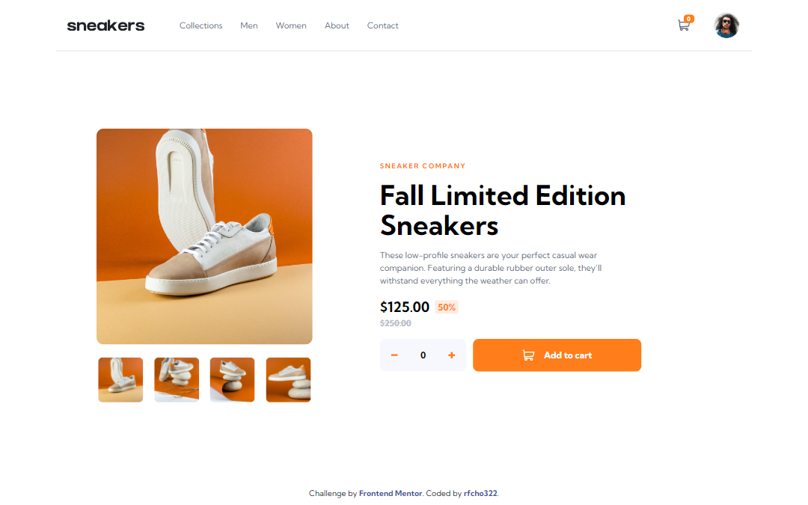
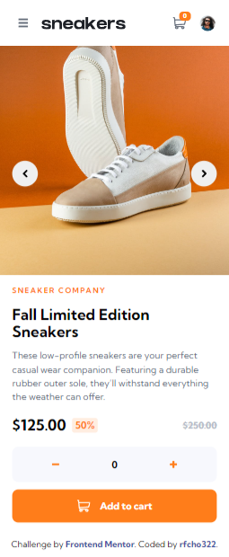

# Frontend Mentor - E-commerce product page solution

This is a solution to the [E-commerce product page challenge on Frontend Mentor](https://www.frontendmentor.io/challenges/ecommerce-product-page-UPsZ9MJp6).

## Table of contents

- [Overview](#overview)
  - [The challenge](#the-challenge)
  - [Screenshot](#screenshot)
  - [Links](#links)
- [My process](#my-process)
  - [Built with](#built-with)
- [Author](#author)
## Overview

### The challenge

Users should be able to:

- &#9989; View the optimal layout for the site depending on their device's screen size
- &#9989; See hover states for all interactive elements on the page
- &#9989; Open a lightbox gallery by clicking on the large product image
- &#9989; Switch the large product image by clicking on the small thumbnail images
- &#9989; Add items to the cart
- &#9989; View the cart and remove items from it

### Screenshot

  <strong>Desktop</strong>

  

  <strong>Mobile</strong>

  

### Links

- Frontend Mentor solution URL: [E-commerce Product Page Solution](https://www.frontendmentor.io/solutions/ecommerce-product-page-inPRa187Ig)
- Live Site URL: [E-commerce Product Page Live Website](https://rfcho322.github.io/fem-sneakers/)

## My process

### Built with

- Semantic HTML5 markup
- CSS custom properties
- CSS Flexbox
- CSS Grid
- JavaScript
- Mobile-first workflow

## Author

- Frontend Mentor - [@rfcho322](https://www.frontendmentor.io/profile/rfcho322)